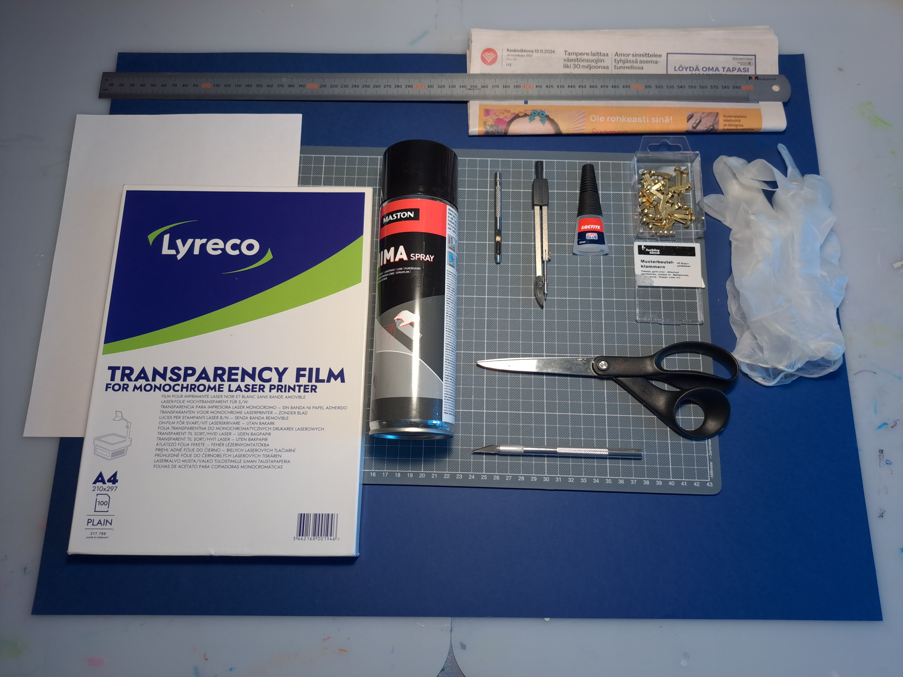
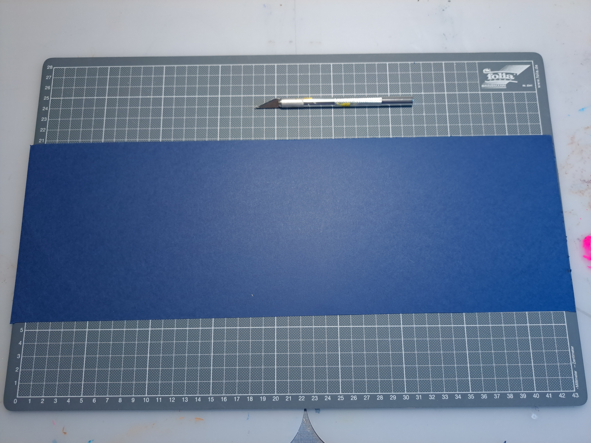
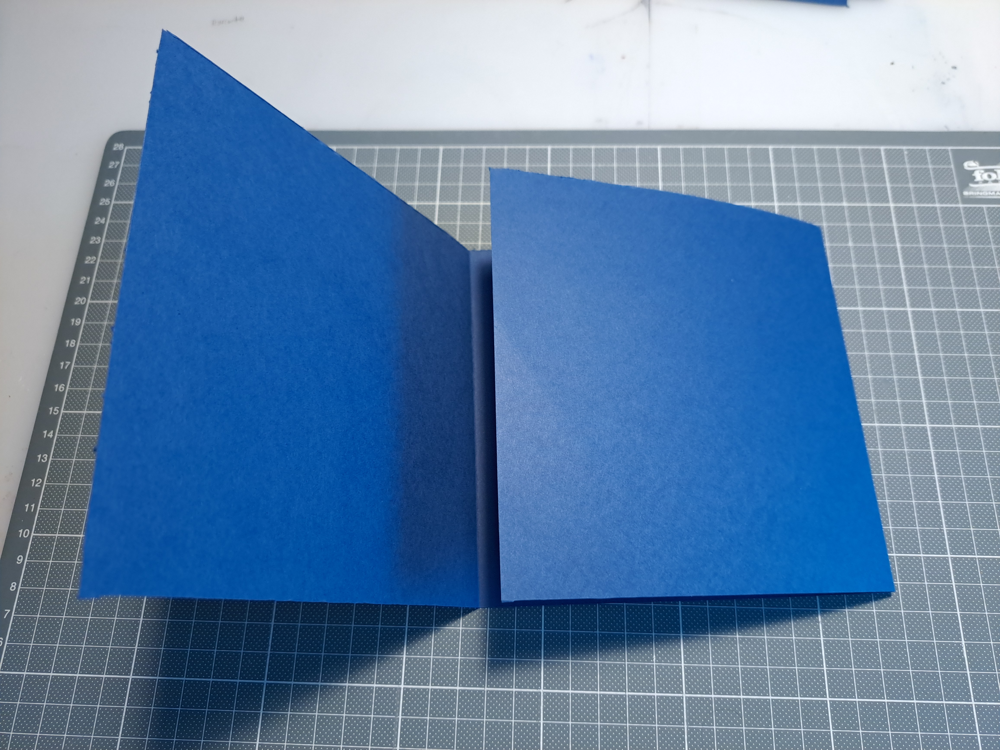
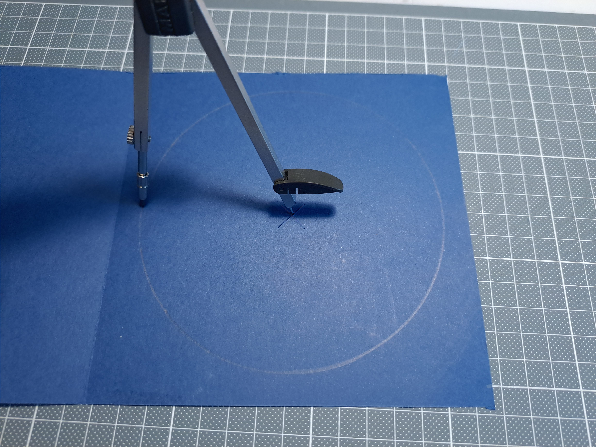
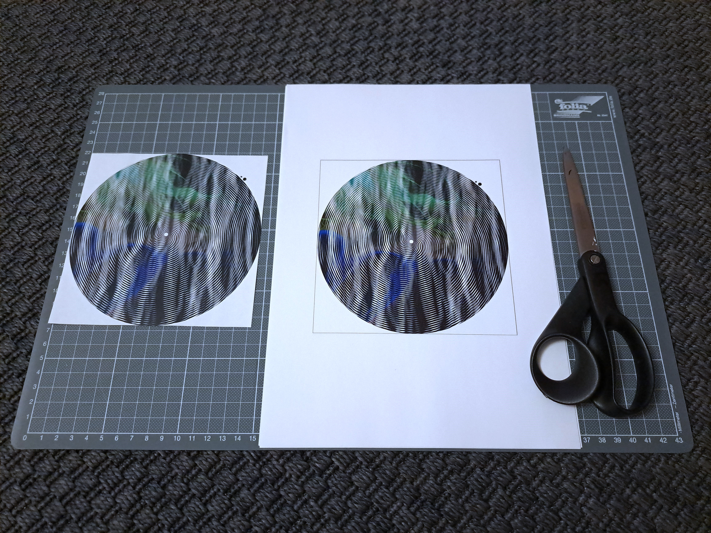
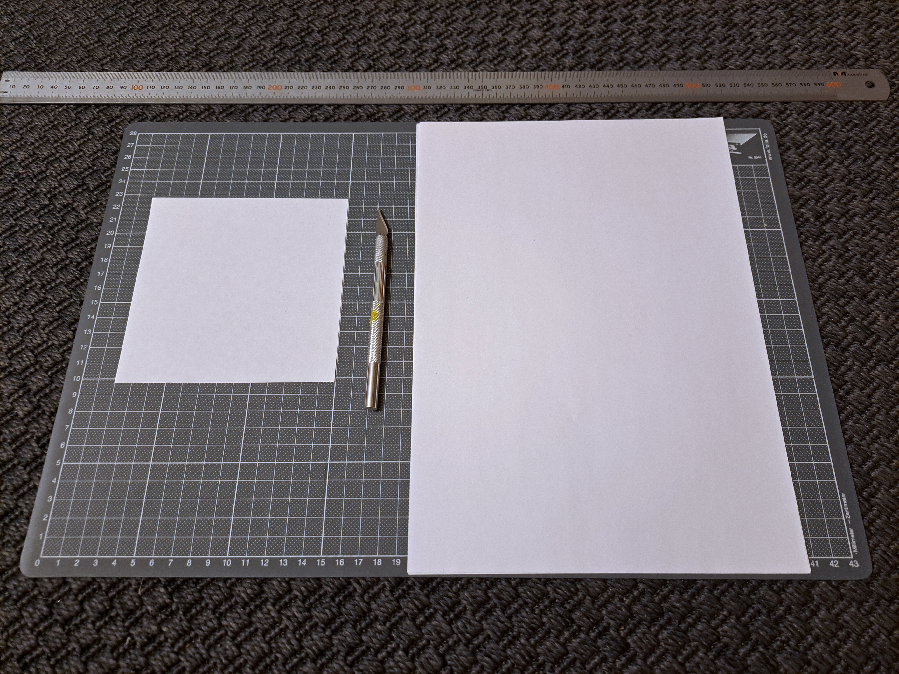
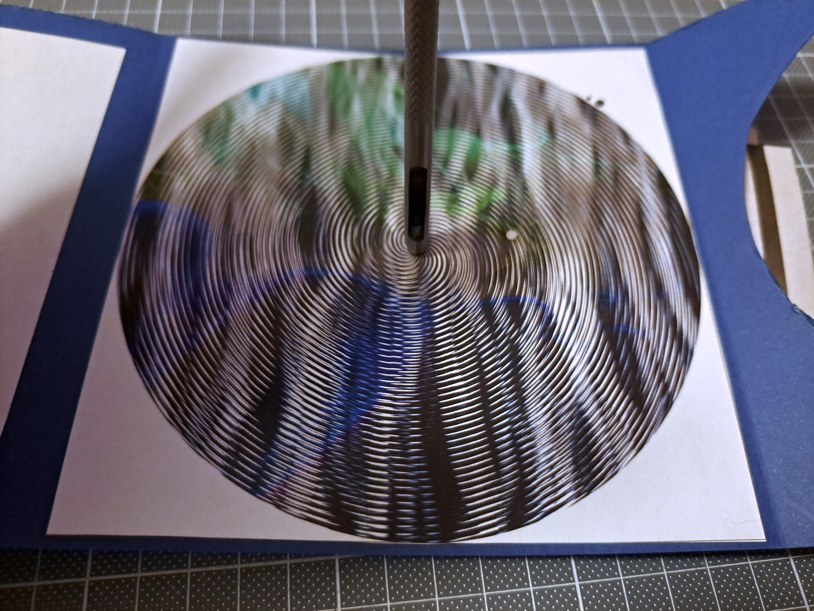
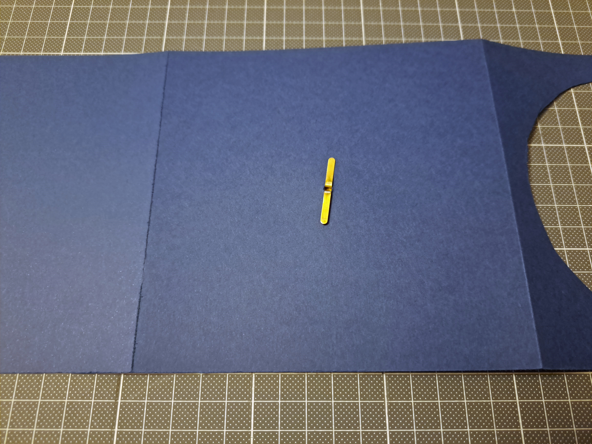
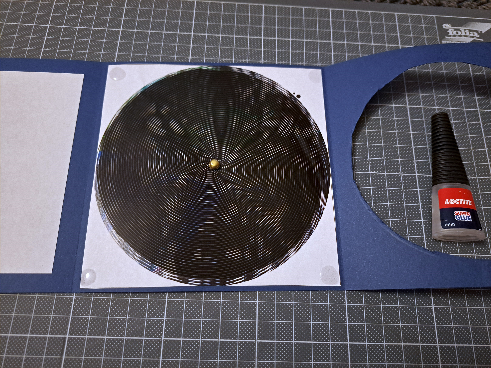

# shader-holiday-card

Instructions on how to make animated holiday cards from OpenGL shaders.

[](https://www.youtube.com/watch?v=iDa7Zn4C6UA)

## Background

For the past years, I've participated in the Demoscene Holiday Card Exchange
([2020](https://www.pouet.net/topic.php?which=11998),
[2021](https://www.pouet.net/topic.php?which=12205),
[2022](https://www.pouet.net/topic.php?which=12374),
[2023](https://www.pouet.net/topic.php?which=12543),
[2024](https://www.pouet.net/topic.php?which=12731)). I made animated cards, in
the spirit of over head projector effects. If you don't know what that means,
see for example: [Shapes by Cortex](https://www.pouet.net/prod.php?which=53773).

The basic mechanism in all years was the same. The card consists of a
background, printed on a white paper, and a foreground, printed on a transparent
film and cut to the shape of a circle. The foreground is mostly black, with some
transparent areas. A hole is punched in the middle of both the background and
the foreground, and they are attached using a brass fastener. This allows the
foreground to be rotated 360 degrees. As the foreground is rotated, it reveals
different parts of the background, creating an animation. In particular, this
can be used make type of [barrier-grid
animations](https://en.wikipedia.org/wiki/Barrier-grid_animation_and_stereography),
with a spiral shaped barrier. These are also sometimes known as scanimations or
Moiré animations.

The designs were prototyped with [Shadertoy](https://www.shadertoy.com/view/lcycD3),
exported as JPG with Python, printed using a laser printer on paper and
on film, and finally assembled onto a cardboard backing.

## Materials and tools needed



1. **Transparent film, suitable for printing.** I printed using a laser printer,
   and laser printers require the use of dedicated films that can withstand the
   heat without warping and shrinking. Furthermore, there's both monochrome
   laser and color laser transparencies, which apperently have slightly
   different coatings. My designs only used grayscale foregrounds, so monochrome
   laser transparencies were ok. I used "Lyreco Transparency film for monochrome
   laser printer", material: PET, size: A4.
2. **Brass fasteners.** I used brass fasteners (split pins), with a width of ~ 3
   mm.
3. **Cardboard.** Each card requires a 15 cm x 45 cm rectangle. I used 50 cm x
   65 cm 240 g/m^2 cardboard sheets from Canson. Thus, from each sheet, I got 4
   cards. I preferred dark cardboard (black, ultramarine), because the animation
   will be quite dark, due to majority of the foreground being black.
4. **Spray adhesive.** I used Maston 500 ml Spray Adhesive. Not all of them are
   equal: some cheaper brands created awful clumps and did not spray evenly.
5. **Super glue.** I used Loctite 5g Precision. Some of the cheap stuff I tested
   didn't actually glue anything, so go with Loctite if you want to be sure that
   the glue works.
6. **Hole punch.** This should match the size of the brass fasteners. Mine were
   3 mm, so I used a 3 mm punch. Note that it needs to reach the center of the
   film and the paper, so it needs to be one of the types that look a bit like
   hollow cylinders. The ones that only reach a few cm from the edge of the
   paper cannot be used.
7. **Precision cutting knife**. X-acto or similar.
8. **Compass**. The tool for drawing circles, not the device for finding the
   magnetic north.
9. **Paper cutting board**. Preferably with one dimension over 45 cm and a grid.
10. **White paper**.
11. **Newspaper or similar**. On which one can apply the spray adhesive.
12. **Disposable gloves**. The spray adhesive and superglue are kinda nasty on
    fingers, so use these when applying the adhesives.
13. **Scissors**.

## Making the animation as a OpenGL shader

The OpenGL shader should output both the background (paper print) and the
foreground (film print). The 2024 card was designed as follows: first, I wrote a
general shader effect in Shadertoy and making sure that it loops with a period
of t = 1. Shadertoy gives the time in a uniform called iTime. So the looping
animation can be put in a function `vec3 animation(vec2 uv,float t)` which takes
the screen coordinates and time as parameters and outputs an RGB color.

The foreground will be a 16-armed spiral with 50 rings from center to edge, with
majority of it being black and 20% will be transparent (white). For each pixel
we can calculate "phase", with something like `phase =
mod(16*atan2(y,x)/(2*pi)+50*length(vec2(x,y)),1)` and in the foreground, if
`phase < 0.2`, then the pixel is white, otherwise it is black. The spiral loops
after it is turned 1/16th circle, so in the final card, the animation starts
looping after the foreground is turned 1/16th circle.

The background print is now simply produced by `pixelcolor =
animation(uv,phase)`, where phase is calculated using the same equation as in
the foreground and the animation was the original animation. Note that due to
the duty cycle of the foreground being 20%, at every instance we see not only
the current slice t of the animation, but all colors in a time range of [t,t -
0.2]. So there will be significant "motion blur". You can decrease the duty
cycle to make the animation sharper, but this will also make the whole animation
darker, so you may want to experiment here to get the results you want. I've
usually used 0.2 - 0.3.

The background should include some cutting aides, to cut it into a square. Also,
both the foreground and the background should include a circle in the center, to
indicate where the hole should be punched. In my case, a 3 mm circle.

Finally, due to alignment errors in the final card, the effect tends to
break near the middle and to work better on the edges. Thus, effects
with darkness in the middle (tunnels, starfields) seem to work the best.

Examples of animations I've made over the years (use mouse to see how the
animation looks as a barrier-grid animation):

| Year | Effect | Source                     | Shadertoy prototype                                                                                    |
|------|--------|----------------------------|--------------------------------------------------------------------------------------------------------|
| 2021 | Tunnel | [tunnel.frag](tunnel.frag) | [](https://www.shadertoy.com/view/NtKGWh) |
| 2022 | Gears  | [gears.frag](gears.frag)   | [](https://www.shadertoy.com/view/DssSDS)  |
| 2023 | Torus  | [torus.frag](torus.frag)   | [](https://www.shadertoy.com/view/mlKcWt)  |
| 2024 | Snow   | [snow.frag](snow.frag)     | [](https://www.shadertoy.com/view/lcycD3)   |

Now, fork one of the shaders and make your own animation! Once you are happy
with your shader, save it into .frag file, following the examples above, and
continue to the next step.

## Exporting the designs as JPGs using Python

Prerequisites: [Python](https://www.python.org/) and
[poetry](https://python-poetry.org/). Then:

1. Download the sourcecode from [https://github.com/vsariola/shader-holiday-card/](here)

2. Run:

```
poetry install
poetry run python card.py <your_shader>.frag
```

This will export background.jpg and foreground.jpg, with nominal sizes
of 14.5 cm x 14.5 cm in 8192 x 8192 resolution.

Try `poetry run python card.py --help` for more export options.

Note that the foreground design will be *mirrored*: we want the printed side of
the film facing directly against the printed side of the paper. I included some
small and large circle in the design allowing figuring out which side is which;
otherwise it's a bit tough to see from the film.

To actually print the designs on Windows, to my shock I discovered that of the
default Windows software, Paint had the best control of the final dimensions of
the print. It even read the DPI correctly, so if you do Page Setup before
printing (File -> Print -> Page Setup), you can make the final print centered on
paper and exactly 14.5 cm x 14.5 cm.

## Making the card

1. Cut a 15 cm x 45 cm rectangle from the cardboard.



2. With the backside of the knife, score the cardboard, splitting the
   cardboard into a 151 mm, 150 mm and a 149 mm section. We'll call
   these the left, middle, and right sections. Then flip the cardboard
   over, so the scored side is down.


3. Fold the right section to the center, then the left section on top.
   The scored side should be the outside of the folds. Then unfold both
   sections again.



4. Mark the center of the right section. This is done by drawing two
   lines corner to corner.


5. Use a compass to draw a 130 mm diameter (65 mm radius) circle centered on the
   center mark. The drawing should be inside, so it will not be visible in the
   final card.



6. Carefully cut out the circle, using the knife.


7. Cut the background print into a 145 mm x 145 mm square. You can use scissors
   here; this cut is not super critical.



8. Cut a 13 cm x 13 cm square from white paper.



9. Place the background print and the paper square on newspaper, face down, and
   spray them with the spray adhesive. Do this outdoors; the spray adhesive
   smells bad. Use gloves.


10. Glue the background print to the middle of the center section, with 2.5 mm
   tolerance on each side. Glue the white square to the left section, with 1 cm
   tolerance on each side.


11. Cut the foreground film print into a 14 cm circle. Use the symbols on the
    film to figure which side of the film is which; we want the printed side of
    the film facing directly against the printed side of the paper.


12. Punch the centers of both the background (with cardboard backing) and the
    foreground. Try to hit the center as close as possible; if it's misaligned,
    the animation will wobble.



13. Use a brass fastener to attach the foreground to the background.



14. Place a drop of super glue into each of the four corners of the
    middle section, then fold the right section on top.



15. Done!


